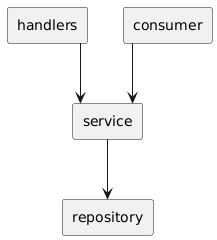

### Начало работы:
Для запуска используете команду __make dc__. После этого, для более подробных инструкций, проследуйте по адресу __http://localhost:8089__

**Makefile:**
- __dc__: Поднимает все необходимое в докере с помощью команды docker-compose up.
- __swag gen__: генерирует swagger документацию и выводит генерируемые файлы в паку docs. Также можно использовать для обновления документации. 
- __mock gen handlers__: генерирует моки для пакета handlers.
- __test__: запускает тесты.
- __lint__: запускает выбранные линты.

**Environment:**
Структура в которой хранятся env переменные находиться в __config.go__ в ./internal/config. Работа с переменными производится с помощью пакета __github.com/caarlos0/env__.

**Endpoints:**
- __http://localhost:8080/get/:date__: получение метаданных изображения согласно дате.
- __http://localhost:8080/get__: получение метаданных всех изображений.
- __http://localhost:8080/docs/index.html__: документация swagger.
- __http://localhost:8089/__: вводная страничка. 
- __http://localhost:8089/{date}.jpg__: получение изображения согласно дате.

**Архитектура проекта:** 
За основу проекта взят __service layer pattern__,  который позволяет упорядочить и улучшить структуру проекта. 

<!-- **Используемые пакеты:**
	github.com/caarlos0/env/v11 v11.2.2
	github.com/jackc/pgx/v5 v5.7.1
	github.com/julienschmidt/httprouter v1.3.0
	github.com/ory/dockertest v3.3.5+incompatible
	github.com/sirupsen/logrus v1.9.3
	github.com/stretchr/testify v1.9.0
	github.com/swaggo/http-swagger v1.3.4
	github.com/swaggo/swag v1.16.3 -->

## Описание задания

### Цель:
Разработать сервис, который будет предоставлять пользователям астрономическую информацию и изображения согласно программе "Изображение дня" (APOD), используя современные технологии программирования и контейнеризации.

**Технологии**: go, postgreSQL, docker, docker-compose, makefile

Основные функции сервиса:
1) Получение метаданных и изображения дня:
  - Реализовать рабочий процесс (воркер), который будет автоматически выполняться раз в сутки;
  - Сервис должен запрашивать метаданные (название, описание, дата, автор) и изображение из публичного [API APOD](https://api.nasa.gov/);
  - Загруженные данные (метаданные и изображение) должны сохраняться в бинарном хранилище. Для хранения изображений можно использовать такие технологии, как Amazon S3, MinIO, другие бинарные хранилища или локальное файловое хранилище.
2) HTTP API сервер:
  - Реализовать следующие методы:
    GET /api/apod — получение всех записей из альбома;
    GET /api/apod/:date — получение записи за выбранный день. Формат даты — YYYY-MM-DD.
  - Убедитесь, что API возвращает ответы в формате JSON и включает соответствующие коды состояния HTTP.
3) Контейнеризация и сборка:
  - Сервис должен быть собран в Docker-образ с использованием Dockerfile;
  - Создайте docker-compose.yml, который будет включать все необходимые сервисы (например, базу данных PostgreSQL и сам сервис);
  - Используйте Makefile для автоматизации сборки, тестирования и развертывания сервиса.

### Дополнительные требования:
  - Конфигурация: Все настройки сервиса (адреса, порты, учетные данные для базы данных и другие параметры) должны быть вынесены в переменные окружения (ENV);
  - Создание структуры базы данных: При первом запуске сервиса должна автоматически создаваться база данных и необходимая структура таблиц (например, таблица для хранения метаданных о каждом изображении);
  - Тестирование: Напишите простые юнит-тесты для основных функций сервиса.

**Примечания:**
  - Обратите внимание на оптимизацию кода и использование лучших практик программирования;
  - Соблюдайте чистоту кода и его стиль (lint, комментарии);
  - Позаботьтесь о документации к API.
